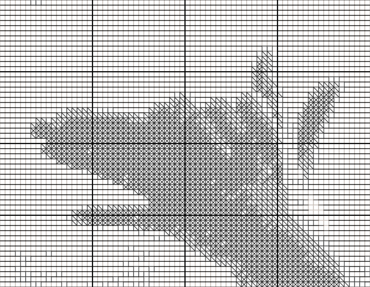
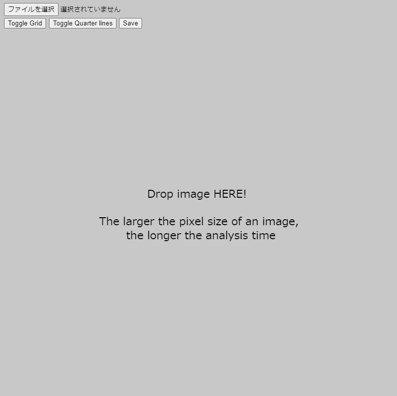

# lineSketch
Version 1.0.1  

# Description
"Line Sketch" is a creative theme proposed by 吉澤春佳 on ["新しいデザインの教科書" | "new-design-textbook"](https://scrapbox.io/new-design-textbook/%E3%83%A9%E3%82%A4%E3%83%B3%E3%82%B9%E3%82%B1%E3%83%83%E3%83%81).   
This application **lineSketch** is an useful tool for the theme above.
By drag&drop an image, we can get the converted image following the theme.

We can play on [GitHub](https://github.com/tetunori/lineSketch) and [OpenProcessing](https://www.openprocessing.org/sketch/945023).

# Usage
1. Just drag&drop an image or select a image file from button.  

2. (OPTIONAL) Toggle Grid/Quarter lines from buttom or 'z'/'x' key. 
2. (OPTIONAL) Save line sketch from buttom or 's' key. 

# Licence
This software is released under the MIT License, see LICENSE.

# Author
Tetsunori NAKAYAMA.

